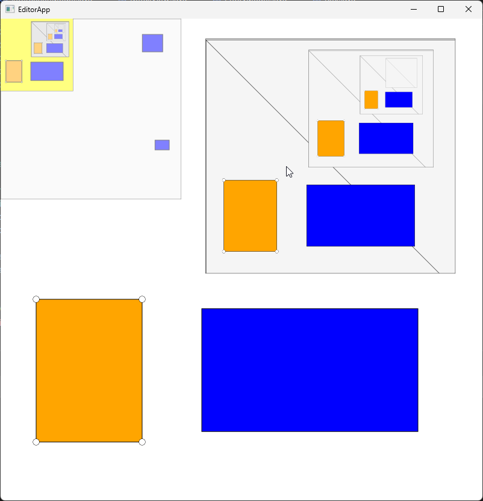
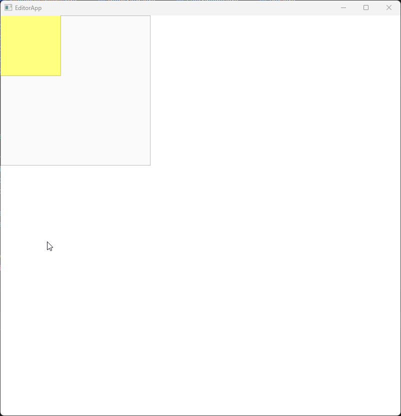

## Overview
This project is a JavaFX-based visual editor designed for creating and manipulating graphical objects within a visual workspace. It features:

- Implementation of the Model-View-Controller (MVC) architecture
- Support for multiple views including a Detail View and a Mini View
- Use of immediate-mode graphics for rendering
- Interactive manipulation of graphical elements such as boxes and portals
- Recursive rendering within portals
- Dynamic viewport panning and zooming
- Handle-based resizing for objects

---

## Table of Contents
- Project Structure
  - Implemented Classes
- Interactions
  - Basic Interactions
  - Portal-Specific Interactions
- Screenshots
- Installation
- Running the Project
- Architecture
- Dependencies
- Notes
- License

---

## Project Structure
### Implemented Classes
- EditorApp: The main application class that serves as the entry point to the program.
- MainUI: Manages the layout and organization of the different views within the user interface.
- EntityModel: The core model class that stores all graphical objects (boxes and portals).
- Box: Represents rectangular shapes stored within the model.
- Portal: Represents portals that display a view of a specific area in the workspace, including recursive rendering.
- InteractionModel: Manages interaction states such as selection, highlighting, and viewport information.
- DetailView: Provides an immediate-mode graphical view of the objects in the model for detailed editing.
- AppController: Handles all user interactions and events in the DetailView.
- MiniView: Displays a miniature overview of the entire workspace for easy navigation.
- MiniController: Manages interactions specifically within the MiniView.
- Subscriber: An interface for implementing the observer pattern, allowing views to update when the models change.

---

## Interactions
### Basic Interactions
- Create Rectangles:
-   Click and drag on the background in the DetailView to draw a new rectangle.
- Move Rectangles:
-   Click and drag an existing rectangle to move it within the workspace.
- Select Rectangles:
  - Click on a rectangle to select it.
  - Creation or dragging an object also selects it.
  - The selected rectangle is orange, while non-selected rectangles are blue.
  - Clicking on the background deselects all objects.
- Delete Rectangles:
  - Press Delete or Backspace to remove any selected objects from the workspace.
- Pan the DetailView:
  - Hold down the Shift key.
  - Click and drag to pan around the workspace in the DetailView.
- Resize Rectangles:
  - Use the circular corner handles that appear on a selected rectangle to resize it.

- Portal-Specific Interactions
- Create a Portal:
  - Hold down the Control key while clicking and dragging to create a new portal rectangle.
- Interact with Objects Inside a Portal:
  - Hold down Control and click or drag to select and move objects within the portal view.
- Pan Within a Portal:
  - Hold Control, then click and drag on the portal’s background to pan its view internally.
- Zoom a Portal:
  - Press the Up Arrow key to zoom into the portal's view.
  - Press the Down Arrow key to zoom out of the portal's view.
 
---
## Screenshots


---

## Installation
### Prerequisites
- Java 23 or higher
- JavaFX 17.0.6
 -Maven

### Steps
- Clone the Repository:
```
git clone https://github.com/ClutchyMuffin/2D-Visual-Editor
```
- Navigate to the Project Directory:
```
cd 2D-Visual-Editor`
```
- Build the Project Using Maven:
```
mvn clean install
```

---

## Running the Project
### Using Your IDE:
- Open the project in your preferred IDE (e.g., IntelliJ IDEA, Eclipse).
- Run the `EditorApp` class

--- 

## Architecture
The application follows the Model-View-Controller (MVC) design pattern to separate concerns:

- Models:
  - EntityModel: Manages the collection of boxes and portals.
  - InteractionModel: Manages UI state, such as selections and current viewport.

- Views:
  - DetailView: The main workspace where users can create and manipulate objects.
  - MiniView: Provides an overview of the entire workspace for quick navigation.

- Controllers:
  - AppController: Handles user input and interactions in the DetailView.
  - MiniController: Handles user input and interactions in the MiniView.

Communication between models and views is implemented using the Publish-Subscribe pattern through the Subscriber interface.

The controllers are designed using a state machine approach to manage complex interactions cleanly and efficiently.

---
## Dependencies
The project uses Maven for dependency management. Key dependencies include:

```
<dependencies>
    <dependency>
        <groupId>org.openjfx</groupId>
        <artifactId>javafx-controls</artifactId>
        <version>17.0.6</version>
    </dependency>
    <!-- Add any other dependencies here -->
</dependencies>
```
Ensure that JavaFX is properly configured in your environment.

---

## Notes
- The `DetailView` adjusts dynamically to fit the window size and responds to window resizing events.
- The application fully adheres to the MVC architecture, ensuring a clear separation of concerns and maintainable code.
- The Publish-Subscribe pattern is utilized for efficient communication between models and views.
- The controller implements a state machine for clean and maintainable interaction handling.
- A separate controller (`MiniController`) is dedicated to handling interactions within the MiniView.

---

## License
This project is licensed under the Apache License 2.0. See the included LICENSE file for more details.
